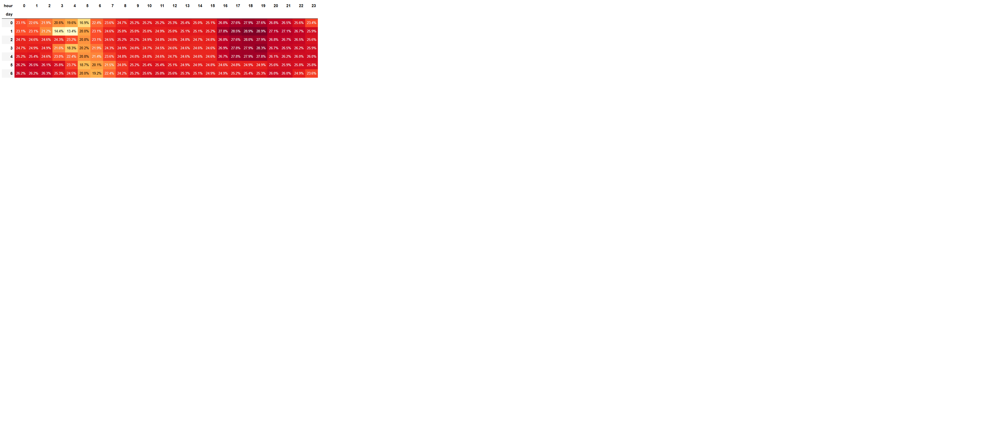

# 🚖 Data Cleaning and Exploratory Analysis of NYC Taxi Dataset (3.5M Records)

## 📌 Project Overview
In this project, I performed a comprehensive data cleaning and exploratory data analysis (EDA) on raw historical New York City taxi trip records. The main goal was to identify and eliminate system glitches, technical anomalies, and noise to prepare a pristine dataset suitable for reliable business intelligence and analysis.

---

## 🛠️ Data Cleaning & Anomaly Detection Log
To ensure data integrity, I designed and implemented a strict filtering pipeline based on logical constraints and domain reality. 

### Filtering Pipeline Summary

| Feature | Cleaning Rule / Logic | Context |
| :--- | :--- | :--- |
| **Passenger Count** | Keep strictly between `1` and `6` | Removes empty trips or data entry errors |
| **Trip Distance** | Cap at `60` miles | Eliminates extreme GPS outliers |
| **Financials (`fare_amount`)** | Range: `$2.5` to `$200` | Removes negative values and terminal glitches |
| **Zero-Distance Exceptions** | Allow `0` miles *only* if fare is `$2.5` - `$70` | Preserves valid trips trapped in gridlock/traffic |
| **Temporal Paradoxes** | Duration must be between `1 min` and `2 hours` | Eliminates instant cancellations and unclosed meters |

> 📉 **Result:** This multi-stage filtering pipeline successfully removed approximately **30% of information noise**, reducing the dataset from 3.5M to a clean and robust **2.8 million records**.

---

## 📊 Key Business Insight: High-Yield Hours for Drivers
Using custom feature engineering (`hour`, `day`) and pivot tables aggregated by the **median tip ratio**, I uncovered distinct passenger behavior patterns.

### Key Insights:

$$\text{Tip Ratio} = \frac{\text{Tip Amount}}{\text{Fare Amount}} \times 100$$

1. **The Rush Hour Dominance (Mon–Fri, 16:00–19:00):** Contrary to the initial hypothesis about weekend party-goers, data reveals that the highest and most consistent tip ratios occur during weekday evening rush hours. This is likely driven by corporate commuters and traffic gridlocks, where passengers are more inclined to tip higher.
2. **The Weekend Late-Night Myth:** While weekend nights (Friday & Saturday, 00:00–04:00) do show steady tipping behavior, they do not surpass the structured volume of the weekday business rush hour.
---

## 🔍 Critical Analytical Note on Data Collection

<b>Click to expand: Why the Mean would lie to you in this dataset</b>

During the exploratory phase, I discovered that the system only captures tipping data for **credit card transactions**. Cash tips are inherently not logged by the taximeter and appear as `0.0` in the raw data. 

* **The Bias:** If we used the standard average (`mean`), these artificial cash zeroes would heavily drag down the metrics, showing fake low tips.
* **The Solution:** Relying on the **median** was a deliberate analytical choice. Since card trips represent the majority of the dataset, the median successfully neutralized this collection bias, preventing cash zeroes from skewing the true operational metrics.

