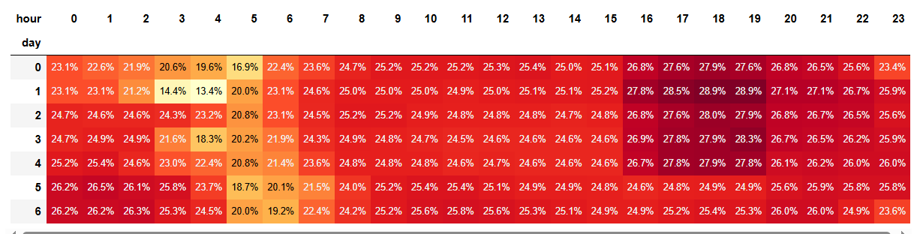

# 🚖 Data Cleaning and Exploratory Analysis of NYC Taxi Dataset (3.5M Records)

## 📌 Project Overview
In this project, I performed a comprehensive data cleaning and exploratory data analysis (EDA) on raw historical New York City taxi trip records. The main goal was to identify and eliminate system glitches, technical anomalies, and noise to prepare a pristine dataset suitable for reliable business intelligence and analysis.

---

## 🛠️ Data Cleaning & Anomaly Detection Log
To ensure data integrity, I designed and implemented a strict filtering pipeline based on logical constraints and domain reality. 

### Filtering Pipeline Summary

| Feature | Cleaning Rule / Logic | Context |
| :--- | :--- | :--- |
| **Passenger Count** | 1 ≤ passenger_count ≤ 6 | Removes empty trips or data entry errors |
| **Trip Distance** | Remove trips with distance > 60 miles | Eliminates extreme GPS outliers |
| **Financials (`fare_amount`)** | 2.5 ≤ fare_amount ≤ 200 | Removes negative values and terminal glitches |
| **Zero-Distance Exceptions** | Allow `0` miles *only* if fare is `$2.5` - `$70` | Preserves valid trips trapped in gridlock/traffic |
| **Temporal Paradoxes** | Duration must be between `1 min` and `2 hours` | Eliminates instant cancellations and unclosed meters |

> 📉 **Result:** Approximately 19% of records were removed by the filtering pipeline, reducing the dataset from 3.5M to 2.8M trips.
---

## 📊 Key Business Insight: High-Yield Hours for Drivers
Using custom feature engineering (`hour`, `day`) and pivot tables aggregated by the **median tip ratio**, I uncovered distinct passenger behavior patterns.

### Key Insights:

$$\text{Tip Ratio} = \frac{\text{Tip Amount}}{\text{Fare Amount}} \times 100$$

1. **The Rush Hour Dominance (Mon–Fri, 16:00–19:00):** Contrary to the initial hypothesis about weekend party-goers, data reveals that the highest and most consistent median tip ratios occur during weekday evening rush hours. This may be associated with weekday commuting patterns and longer or more congested trips, although the dataset does not directly identify passenger purpose.
2. **The Weekend Late-Night Myth:** While weekend nights (Friday & Saturday, 00:00–04:00) do show steady tipping behavior, they do not surpass the structured volume of the weekday business rush hour.
---

## 🔍 Critical Analytical Note on Data Collection

<b>Click to expand: Why the Mean would lie to you in this dataset</b>

During the exploratory phase, I discovered that the system only captures tipping data for **credit card transactions**. Cash tips are inherently not logged by the taximeter and appear as `0.0` in the raw data. 

* **The Bias:** If we used the standard average (`mean`), these artificial cash zeroes would heavily drag down the metrics, showing fake low tips.
* **The Solution:** The **median** was used as a robust summary statistic to reduce the influence of unobserved cash tips recorded as zero. This makes the comparison less sensitive to the artificial zero values, although the analysis remains limited to the tipping information captured by the dataset.

## ⚡ Performance Optimization & Advanced Metrics
* **Big Data Performance:** The pipeline directly processes memory-heavy `.parquet` columnar files using vectorized Pandas operations, optimizing RAM utilization on large scales.
* **Operational Efficiency Metrics:** Engineered custom performance indicators to evaluate taxi fleet economics:
  * `speed_mph`: Vectorized vehicle velocity tracking to pinpoint urban congestion impact.
  * `revenue_per_minute`: Financial yield assessment per operational minute across different tariff codes (`RatecodeID`).

## 🛠️ Technical Stack
* **Language:** Python 3
* **Data Processing:** Pandas (Vectorized filtering, Pivot tables, Conditional formatting), NumPy
* **Storage Engine:** PyArrow / FastParquet
* **Visualization:** Matplotlib, Seaborn

